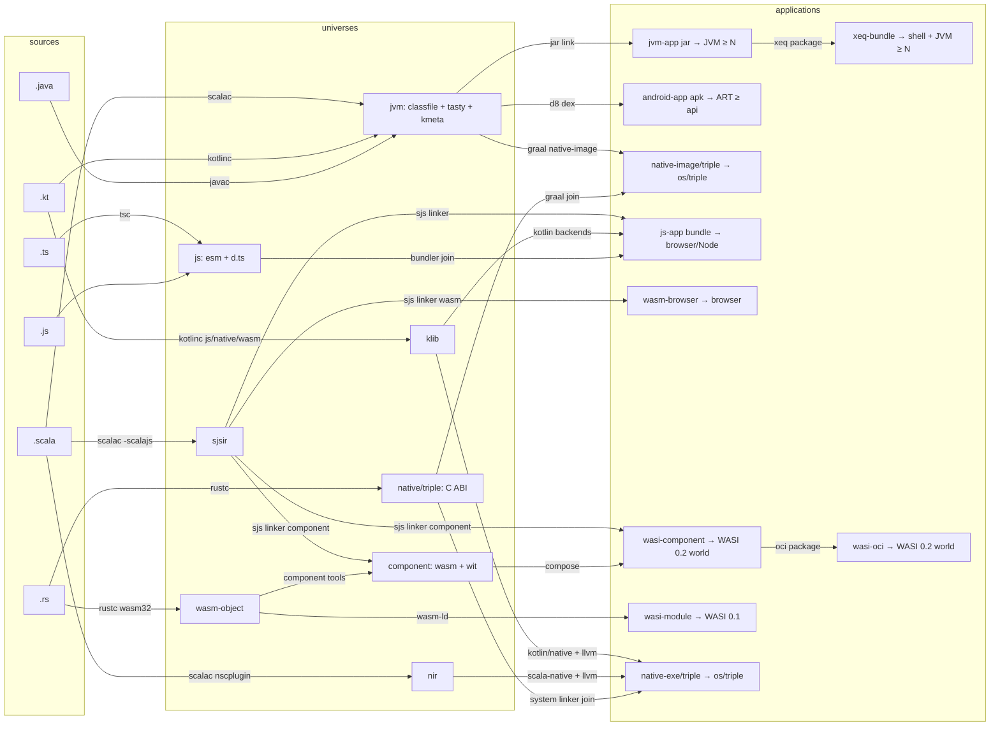

# Universes, Formats, Hosts: a Taxonomy for LIRA

This document defines the vocabulary LIRA uses to categorize compiled representations, and
derives from it: which formats belong in a `.lira` file, how overlapping ecosystems (JS, WASM,
WASI, Android, native) relate, where LLVM fits, and how a target application type is resolved
from a buildpath by search over a pipeline DAG.

The animating observation: terms like "platform", "target", and "ecosystem" conflate several
orthogonal ideas, and the overlaps that make a flat taxonomy feel impossible (SJSIR serves both
the JS and WASM worlds; WASM appears both as an output and as a linkable unit; classfiles are
both a library format and an executable one) dissolve once we categorize by **role in a
pipeline graph** rather than by file format.

## 1. Definitions

> **Status.** The definitions of this section are now normative in the spec's taxonomy
> (spec §4.1: format, realm, universe, host, host contract, application type, egress, join,
> ecosystem, language, platform, compatible; the spec's generic section-key axis is the
> **realm**, a term postdating this document — where this document says "world" in that role,
> read "realm"). This section remains the informative elaboration —
> the litmus-test walkthroughs and the registry below — and where wording differs, the spec
> governs. The application-type examples and the packaging exclusion from **egress** are
> likewise normative (spec §4.1); the application types themselves, and their triple
> parameterization, are not spec objects at all (§6).

**Format.** A concrete byte-level encoding: classfile, TASTy, SJSIR, NIR, Kotlin `@Metadata`,
klib, `.d.ts`, ES module, rmeta/rlib, LLVM bitcode, WASM core module, WASM component, WIT, DEX,
ELF/Mach-O/PE object. A format has no intrinsic role: the same format can appear at different
places in the pipeline with different meanings.

**Universe.** A *library-composition world*: the place where independently-published,
open-world libraries coexist and are later linked. A universe is characterized by three things:

1. an **interface convention** — how a library's API is expressed to other libraries
   (TASTy, classfile signatures, `@Metadata`, `.d.ts`, WIT, C headers);
2. a **linkage mechanism** — how library artifacts are combined
   (JVM classloading, the Scala.js linker, the Scala Native linker, JS bundlers/ESM resolution,
   `wasm-ld`, component composition, the system linker);
3. a **capability model** — what the composed code may assume exists around it.

The litmus test for "is X a universe": *do independently-published libraries meet and compose
there?* SJSIR passes (the Scala.js linker consumes the sjsir of many libraries). DEX fails
(Android libraries ship classfiles; dexing happens after the library world closes). LLVM IR
fails (no ecosystem publishes libraries as bitcode for open composition).

**A universe is what a library's LIRA section is keyed by.** (The spec has since generalized
the key to the **realm**, of which universes are the composing kind, `host` and `app` the
non-composing ones.) Sections of a library hold open-world, pre-link representations, because
such a `.lira` file is a *library*.

**Host.** A runtime environment that executes *closed* artifacts, exposing a **versioned
capability interface**: the JVM (JDK N), a browser (DOM/Web APIs), Node (builtins, version),
ART (Android API level), a WASI runtime (WASI 0.1 / 0.2 / 0.3, and for 0.2+ a specific WIT
world), an operating system + libc for a target triple. WASI "previews" are not formats and not
universes: they are host capability contracts, exactly the same kind of thing as "Android
minSdk 26" or "JDK 17+". They belong on the *host* axis, versioned like any API.

**Application type.** A pair (closed artifact format, host contract): an executable jar on
JDK ≥ N; an APK on ART ≥ API 26; an ES-module bundle in a browser; a script for Node ≥ 20; a
core-WASM module + JS glue in a browser; a WASM component exporting `wasi:cli/run@0.2`; that
same component packaged as a Wasm OCI Artifact, for a runtime that schedules it from a registry;
a self-extracting command-line bundle for a POSIX or Windows shell with a JVM; an ELF executable
for `x86_64-linux-gnu`. Application types are what a *build* produces; they are never stored as
composable content. (Since this was written, the spec's `app` realm lets a **deployable
release** store or pin exactly one, as *closed* content — spec §9.4,
[`spec/services.md`](../spec/services.md) — which refines rather than reverses this rule: the
artifact still composes in no universe.)

Two application types may share a format and differ only in how it is packaged: a WASM component
and that component wrapped as an OCI artifact are the same bytes under different envelopes,
distinguishable to a build because they reach different hosts. A packaging step is not an egress
— it closes over nothing and reads no `.lira` file (spec §4.1) — but it is an edge of the
pipeline all the same, running from one application type to another, and resolution follows it
exactly as it follows an egress.

**Egress.** A linking edge from a universe to an application type: it consumes the closed set
of that universe's library artifacts (drawn from a buildpath) and produces the application
artifact. One universe may have many egresses — this is the resolution of the "SJSIR serves
JS *and* WASM" puzzle:

- `sjsir` has egresses to **js-app** (ESM/CJS/script), **wasm-browser** (core wasm + JS glue),
  and **wasi-component** (WASM component against a WIT world, WASI 0.2), which in turn packages
  to **wasi-oci** (that component as a Wasm OCI Artifact).
- `jvm` has egresses to **jvm-app** (jar), **android-app** (DEX/APK, via D8),
  **native-image/⟨triple⟩** (GraalVM native-image), and **xeq-bundle** (a jar appended to a
  native launcher stub, wrapped in a polyglot script).

A library never chooses its egress; an application does. That is *why* the sjsir section is
stored once and serves four application types.

**Join.** The point where two universes' contributions merge into one application. Examples:
the output of the sjsir→js egress joins the `js` universe (a bundler links Scala.js output
with TypeScript-compiled and hand-written JS libraries); the nir→native egress joins the
`native/<triple>` C-ABI universe (system linker combines it with `.a`/`.so` libraries); WASM
components from Rust and from Scala compose in the component world via WIT interfaces. Joins
are what make *cross-language buildpaths* meaningful: they are explicit edges in the DAG, not
an informal notion of "ecosystem overlap".

## 2. The universe registry (initial)

| Universe          | Interface convention        | Library artifacts stored     | Languages producing it        |
| ----------------- | --------------------------- | ---------------------------- | ----------------------------- |
| `jvm`             | classfile sigs (+ TASTy, + `@Metadata`) | `.class`, `.tasty`, Kotlin metadata | Scala, Kotlin, Java |
| `sjsir`           | TASTy                       | `.sjsir` (+ divergent `.class`/`.tasty` per overlay rules) | Scala |
| `nir`             | TASTy                       | `.nir` (+ divergent files)   | Scala                         |
| `js`              | `.d.ts` (or none)           | ES/CJS modules, `.d.ts`      | TypeScript, JavaScript        |
| `klib`            | Kotlin metadata             | klib contents                | Kotlin (JS/Native/WASM backends) |
| `component`       | WIT                         | WASM components (library components) | Rust, Scala (via sjsir egress), any |
| `native/<triple>` | C headers / C ABI           | `.a`/`.so`/`.dylib` archives | Rust, C/C++, any AOT language |
| `wasm-object`     | linking-section symbols     | relocatable `.o` wasm        | Rust, C/C++ (wasm targets)    |
| `crate`           | rmeta / source              | Rust source + rmeta          | Rust (informative; Rust-to-Rust distribution is source-based today) |

Notes:

- One *section* holds one universe's view. A Scala library ships `jvm` + `sjsir` + `nir`
  sections; a Kotlin multiplatform library ships `jvm` + `klib` sections; a TypeScript library
  ships a `js` section; a polyglot buildpath mixes them freely.
- The `jvm` universe is shared by three languages with three interface conventions layered
  over one linkage mechanism. The *universe* is one (they classload together); the
  *disciplines* differ (see `compatibility.md`).
- The dual-role formats are handled by role, not by format: a WASM component is an application
  type when it exports a runnable world, and a `component`-universe library when it is composed
  with others; a classfile set is a `jvm` library until an egress closes it into a jar/APK.
  One tool edge can therefore land in either node: the sjs linker's component output is a
  `wasi-component` application when the world it exports is runnable, and `component`-universe
  library content otherwise — which is what the registry's "Scala (via sjsir egress)" row means,
  and why the DAG draws the same-labelled edge into both.
- `native/<triple>` is a family of universes, one per target triple, because C-ABI artifacts
  do not compose across triples. Triple-parameterized universes arrive as a schema layer.
- The application axis is parameterized by triple for the same reason, one step further on:
  `native-exe/<triple>` and `native-image/<triple>` are families, one member per triple, because
  a closed native artifact does not *run* across triples any more than an open one composes
  across them. The parameter is part of the application type rather than a setting of its
  egress, since it is what decides whether the artifact runs at all on the host in hand — as
  visible a distinction to whoever receives the artifact as jar-versus-bundle is.

## 3. Where LLVM fits

Nowhere in the storage model, deliberately. LLVM IR is the shared *lowering infrastructure
inside egress edges*: `nir → native` runs NIR through LLVM; Kotlin/Native lowers klib through
LLVM; Rust lowers MIR through LLVM; clang lowers C. It fails the universe litmus test — no
ecosystem publishes open-world libraries as bitcode for composition (bitcode is
version-unstable and bakes in triple/ABI decisions) — so LLVM is an implementation detail of
edges, not a node. The only LIRA-relevant appearance is optional: embedded bitcode alongside
`native/<triple>` archives to enable cross-language LTO, stored under the `opaque/1`
discipline as auxiliary content.

The same reasoning classifies DEX (link-stage format inside the `jvm → android-app` egress;
Android's *library* format is classfiles) and minified bundles (inside `js → js-app`).

## 4. The pipeline DAG

Nodes are formats-in-role (sources, universes, application types, hosts); edges are tools
(compilers, linkers/egresses, joins). Application resolution is graph search over this DAG.



(LLVM sits invisibly inside the three edges into `EXE`/`NIMG`; DEX inside the edge into
`APK`. `EXE` and `NIMG` are families, one node per triple, elided here to one box each.)

Two edges run between application nodes rather than out of a universe: `JAR → XEQ` and
`WASI2 → WASIOCI`. Both are packaging steps, which take a closed artifact and re-envelope it for
a different host, so their input is an application artifact and not a set of library artifacts.
Resolution treats them like any other edge — the path from `jvm` to `xeq-bundle` simply runs two
tools — and nothing about either is visible to a library.

### 4.1 Resolution

Given a buildpath **B** (each lira offering sections in certain universes) and a requested
application type **T**:

1. Identify the egresses producing **T**, and therefore the **primary universe** each egress
   closes over, plus the universes that **join** at that egress.
2. For each lira in **B**, check it offers a section in the primary universe or in a universe
   that joins on the path to **T**. A lira offering neither makes **B** unresolvable for
   **T** — reported at validation time with the exact missing universe, never discovered at
   link time.
3. Check host-contract satisfiability: every per-section/host requirement (min JDK, Android
   API level, WASI world and version, Node version…) must be jointly satisfiable for **T**'s
   host. These are ordinary versioned-interface constraints on the host axis.
4. Execute the pipeline: materialize sections, run the egress tool, run join tools.

The DAG should ultimately be machine-readable — a TEL document (`universes.tel`) shipping with
the toolchain, registering universes, egresses, joins, and the tools implementing each edge —
so that step 4 is data-driven and new universes/egresses are registry entries, not code
changes. Steps 1–3 are now normative as the **target** and `serves` rules of spec §13.2–§13.3
and §13.5 (host-contract satisfiability as rule 7); step 4 remains build-tool territory pending
the registry.

## 5. Hosts as modules: the `requires` axis

> **Status.** This design is now normative: [`spec/hosts.md`](../spec/hosts.md) specifies host
> contracts, the `host` realm, `requires`, satisfaction and cross-contract spanning, the
> `capability/1` discipline, and the third verification moment (§5.5 below). The subsections
> below are kept as the derivation and rationale; where they differ from `hosts.md`, the spec
> governs.

§4.1 step 3 checks host-contract satisfiability as a side condition, and compatibility.md §9
reserves a unification as "a possible later elegance": *a host contract is a module whose atoms
are capabilities, and a section's `requires` is a dependency edge against it.* This section takes
that seriously, because it costs nothing and it answers a class of question the format otherwise
cannot — the motivating one being **shell commands a library invokes at runtime**.

### 5.1 Why this is not a library discipline

The tempting move is a `shell` discipline, sitting beside the language disciplines, that
atomizes a library's shell-command requirements.
It does not work, in three independent ways:

- **Nothing to atomize.** A discipline is `content → atoms` (spec §11.2), claiming blobs by path
  and bytes. Command availability is a property of the environment, not of any blob. Spec
  **L127** now invalidates a release declaring a discipline whose domain is disjoint from the
  sections it carries, which is exactly this case.
- **Inverted polarity.** Atoms describe what a module *provides*, and rigid atoms are monotonic
  because *addition is safe* (spec §10.2–§10.3). A requirement is what a module *needs*, and
  adding one breaks consumers whose environment lacks it. Encoding requirements as the module's
  own atoms would force a synthetic singleton atom over the whole requirement set, making even
  the removal of a requirement a major event.
- **Not derivable.** Spec §16 verifies by recomputation from the payload. No atomizer can decide
  which commands a jar shells out to; command strings are assembled at runtime from config and
  input. The declaration is irreducibly an assertion about the code, not a fact recovered from it.

### 5.2 The unification

Invert the direction and everything falls into place. **The host is the module.** A host contract
is published as an ordinary lira whose atoms are the capabilities it offers — one rigid atom per
capability — and a library's `requires` is a dependency edge against it, satisfied by the same
lineage-membership rule as any other dependency (spec §13.2).

The polarity is now correct at every point, and no new algebra is needed:

- **Monotonicity means the right thing.** A host that gains a command is a minor step; one that
  loses a command is major and starts a new lineage. That is the actual compatibility behaviour
  of a runtime environment, expressed by the rule that was already there.
- **Used-sets do the interesting work.** A library's Uses blob against the host names only the
  capabilities it actually invokes (spec §13.4), so spanning yields "runs on any host providing
  `sh` and `git`" by set inclusion — computed, not asserted, and usable across host majors.
- **The atomizing discipline can be as simple or as rich as the contract.** For a shell contract
  it is one rigid atom per capability, keyed by name, its value hash over the name plus any
  version predicate. For a contract with a formal grammar it is a real discipline with real
  folding decisions — §5.4 works Web IDL through. Either way it is a discipline over the
  *host's* content, where there genuinely is content to atomize, so §11.2 is satisfied honestly.

Requirements sit on **sections**, not on the release: a library may shell out only in its `jvm`
implementation. This does not collide with the cross-section API invariant (spec §9.6), because
requirements are not API — L108 constrains what a release *presents*, and two sections presenting
one interface while needing different things of their hosts is ordinary, not a violation.

### 5.3 Shell commands: the informal case

```text
section jvm
  tree Ef56…
  requires posix/1  Kx3f…     # host contract snapshot
```

with the library's Uses blob against `posix/1` naming `sh`, `git`, `tar`. Two granularity
decisions, both with the same answer as the triple problem:

- **Version predicates.** A capability is a name plus an OPTIONAL version predicate
  (`git >= 2.30`). The predicate folds into the capability's atom value, so a host tightening a
  minimum is correctly a new atom and hence major.
- **Implementation variants.** `sed`, `awk` and `find` differ materially between GNU and BSD, and
  a library depending on GNU extensions depends on a different capability than one that does not.
  Treat the bare name as **POSIX-conformant behaviour only** — `requires sh` means a POSIX `sh` —
  and give variants their own capability names (`sed:gnu`), exactly as `native/<triple>`
  parameterizes a universe rather than pretending one native target is another. Coarse, honest,
  and it makes the common portable case the short one.

### 5.4 Web IDL: the formal case, and `webidl/1`

Shell commands are the case where a host contract has no grammar at all. **Web IDL** is the
opposite, and it is the better example: the DOM and the Web APIs are already specified in a
formal, versioned, machine-readable IDL, which is where `lib.dom.d.ts` is generated from.

The first thing to settle is that Web IDL is *not* a JS library discipline. A browser is a host
(§1), not a universe; a library in the `js` universe publishes ES modules and `.d.ts`, and its
carrier is `.d.ts`. Web IDL describes what the *platform* provides. Placing a `webidl` discipline
beside `dts` in compatibility.md would atomize, in a representation nobody compiles against, a
surface `dts` already covers. Placed on the host axis it describes something nothing else does.

**Atomization.** One rigid atom per exposed construct, keyed by its IDL path:

- `interface` templates, and each `attribute` and `operation` as a **standalone** atom;
- `dictionary` members, with the required/optional distinction load-bearing (below);
- `enum` values, `typedef`s, `namespace` members, and `[Exposed=...]` as part of the key, since
  `Window` and `WorkerGlobalScope` genuinely offer different surfaces.

**The folding decisions, and why they differ from `dts`.** compatibility.md §4 records
TypeScript's hard problem: adding a member to an exported `interface` is safe for consumers who
*call* it and breaking for consumers who *implement* it, and "TypeScript cannot see usage
direction from the declaration alone", so `dts` must fold member lists by default and lose
additivity to soundness.

Web IDL answers exactly that question, in its syntax. `partial interface` and `includes` mixins
exist *because* the platform adds members to existing interfaces continuously, and nothing
outside the browser implements `Element`. The direction is declared, so:

- interface members are **standalone** atoms — adding one is a minor, which is the actual
  compatibility behaviour of every browser release;
- `dictionary` members **fold when required and stand alone when optional** — adding a required
  member breaks every caller constructing that dictionary, adding an optional one breaks nobody,
  and unlike TypeScript the IDL says which it is;
- `enum` values are standalone: an enum is a parameter type, so a new value widens what the
  platform accepts;
- removing or renaming anything, narrowing an argument type, or making an optional dictionary
  member required is a removal, hence major.

That contrast is the point worth keeping: `dts` and `webidl/1` describe overlapping surfaces and
fold them differently, and neither is wrong. The folding principle turns on what the carrier can
*express*, not on the language it describes.

**Guarantee.** Recompilation, for the TypeScript consumers who type-check against the generated
declarations — and nothing else. There is no linkage in a browser to protect, and whether a
present API *behaves* is out of scope as always (spec §18).

**Prior art.** The `@webref/idl` curated IDL extracts, MDN's browser-compat-data, and the
"Baseline" interoperability definitions are all, in effect, published host contracts already;
`webidl/1` is a proposal to give them an identity and an algebra rather than to invent them.

### 5.5 A third verification moment

Everything else in LIRA is verified at publish time by recomputation from the payload, or at
buildpath resolution from manifests. This is neither. A `requires` claim is checked by **probing
the environment at install or launch time** — `command -v git` is decidable in a way that "does
this bytecode shell out to git" is not.

For a Web IDL contract the check is not merely decidable but idiomatic: feature detection —
`'IntersectionObserver' in window` — is how the web platform has always been consumed, so a
`requires` set over `webidl/1` atoms is a machine-readable form of what careful web code already
does by hand, and can be checked once at startup rather than at each first use.

That is a genuinely new verification moment and it must be labelled as such wherever it lands in
the spec, because the failure mode is a reader assuming `requires` was checked against the code.
It was not, and cannot be. What the format buys is not verification of the claim but *precision
and timing*: the requirement is machine-readable, checked before the code runs rather than at the
moment it shells out, and reported against the host the user actually has.

A profile (spec §11.6) may add a best-effort publish-time predicate — a linter over process-exec
call sites, flagging commands invoked but not declared. Sound in one direction only: it can catch
an omission, never prove the list complete.

### 5.6 Open questions

Three of the four questions this section originally posed are resolved by
[`spec/hosts.md`](../spec/hosts.md): the section question — a `host` **realm**, a section key
that is not a universe, so contract content is ordinary content and the §1 litmus test is
preserved by naming rather than bent (spec §4.1, §9.4, L135); the probe question — an advisory
`probe` field on `capability/1` rows, excluded from every atom, treated as untrusted input
(hosts.md §5, §9); and transitive aggregation — required, per hosts.md §10, with joint
satisfiability by the diamond rule.

Still open:

- Who publishes host contracts? A registry-blessed `posix`, `nodejs`, `jdk` set is the obvious
  start, but the namespace is a governance question, not a technical one (hosts.md §11).

## 6. Spec impact

Applied to the spec: the section key is a **realm** — now `jvm | sjsir | nir | host | app`
(§9.4), freeing
`js` for the JS universe proper; the root section is per-file, defined as the first section
(§9.1); the taxonomy of §1 is normative (spec §4.1); host contracts and `requires` are normative
([`spec/hosts.md`](../spec/hosts.md)), in the host-as-module form of §5, with the third
verification moment of §5.5 named in spec §16; and cross-universe dependencies are normative via
the `serves` field and the **target** generalization of buildpath validity and derivation
(spec §13.2, §13.3, §13.5) — the manifest-decidable slice of §4.1's resolution, steps 1–3.
Spec §4.1's application-type examples now cover OCI-packaged components and per-triple native
executables, and its **egress** definition now says explicitly that packaging an application
artifact is not an egress: it closes over nothing and reads no `.lira` file, so it stays outside
the compatibility algebra entirely.

Nothing on the application axis is a schema object, so the nodes and edges added here — the
`wasi-oci` and `xeq-bundle` application types, the packaging edges reaching them, and the
triple-parameterized native families — change no manifest, no atom and no buildpath rule. They
are the pipeline registry's business (item 2 below), and are recorded here so that the registry
has something to be faithful to.

Still proposed:

1. Triple-parameterized universes (`native/<triple>`) — as a schema layer — and, on the
   application axis, the triple-parameterized families `native-exe/<triple>` and
   `native-image/<triple>` (§1, §2). The application axis is not a schema object, so this half
   is a registry concern rather than a spec one.
2. The machine-readable pipeline registry (`universes.tel`) driving §4.1 step 4, so that
   egresses, joins and the tools implementing them are registry entries rather than build-tool
   code. Application-to-application packaging edges (`jar → xeq-bundle`,
   `wasi-component → wasi-oci`) belong in it on the same footing as the egresses out of a
   universe.
