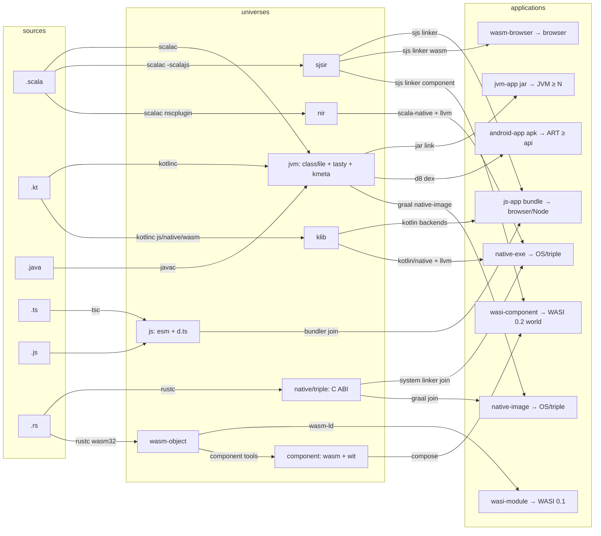

# Universes, Formats, Hosts: a Taxonomy for LIRA

This document defines the vocabulary LIRA uses to categorize compiled representations, and
derives from it: which formats belong in a `.lira` file, how overlapping ecosystems (JS, WASM,
WASI, Android, native) relate, where LLVM fits, and how a target application type is resolved
from a buildpath by search over a pipeline DAG.

The animating observation: terms like "platform", "target", and "ecosystem" conflate several
orthogonal ideas, and the overlaps that make a flat taxonomy feel impossible (SJSIR serves both
the JS and WASM worlds; WASM appears both as an output and as a linkable unit; classfiles are
both a library format and an executable one) dissolve once we categorize by **role in a
pipeline graph** rather than by file format.

## 1. Definitions

**Format.** A concrete byte-level encoding: classfile, TASTy, SJSIR, NIR, Kotlin `@Metadata`,
klib, `.d.ts`, ES module, rmeta/rlib, LLVM bitcode, WASM core module, WASM component, WIT, DEX,
ELF/Mach-O/PE object. A format has no intrinsic role: the same format can appear at different
places in the pipeline with different meanings.

**Universe.** A *library-composition world*: the place where independently-published,
open-world libraries coexist and are later linked. A universe is characterized by three things:

1. an **interface convention** — how a library's API is expressed to other libraries
   (TASTy, classfile signatures, `@Metadata`, `.d.ts`, WIT, C headers);
2. a **linkage mechanism** — how library artifacts are combined
   (JVM classloading, the Scala.js linker, the Scala Native linker, JS bundlers/ESM resolution,
   `wasm-ld`, component composition, the system linker);
3. a **capability model** — what the composed code may assume exists around it.

The litmus test for "is X a universe": *do independently-published libraries meet and compose
there?* SJSIR passes (the Scala.js linker consumes the sjsir of many libraries). DEX fails
(Android libraries ship classfiles; dexing happens after the library world closes). LLVM IR
fails (no ecosystem publishes libraries as bitcode for open composition).

**A universe is what a LIRA section is keyed by.** Sections hold open-world, pre-link
representations, because a `.lira` file is a *library*.

**Host.** A runtime environment that executes *closed* artifacts, exposing a **versioned
capability interface**: the JVM (JDK N), a browser (DOM/Web APIs), Node (builtins, version),
ART (Android API level), a WASI runtime (WASI 0.1 / 0.2 / 0.3, and for 0.2+ a specific WIT
world), an operating system + libc for a target triple. WASI "previews" are not formats and not
universes: they are host capability contracts, exactly the same kind of thing as "Android
minSdk 26" or "JDK 17+". They belong on the *host* axis, versioned like any API.

**Application type.** A pair (closed artifact format, host contract): an executable jar on
JDK ≥ N; an APK on ART ≥ API 26; an ES-module bundle in a browser; a script for Node ≥ 20; a
core-WASM module + JS glue in a browser; a WASM component exporting `wasi:cli/run@0.2`; an ELF
executable for `x86_64-linux-gnu`. Application types are what a *build* produces; they are
never stored in a `.lira` file.

**Egress.** A linking edge from a universe to an application type: it consumes the closed set
of that universe's library artifacts (drawn from a buildpath) and produces the application
artifact. One universe may have many egresses — this is the resolution of the "SJSIR serves
JS *and* WASM" puzzle:

- `sjsir` has egresses to **js-app** (ESM/CJS/script), **wasm-browser** (core wasm + JS glue),
  and **wasi-component** (WASM component against a WIT world, WASI 0.2).
- `jvm` has egresses to **jvm-app** (jar), **android-app** (DEX/APK, via D8), and
  **native-exe** (GraalVM native-image).

A library never chooses its egress; an application does. That is *why* the sjsir section is
stored once and serves three application types.

**Join.** The point where two universes' contributions merge into one application. Examples:
the output of the sjsir→js egress joins the `js` universe (a bundler links Scala.js output
with TypeScript-compiled and hand-written JS libraries); the nir→native egress joins the
`native/<triple>` C-ABI universe (system linker combines it with `.a`/`.so` libraries); WASM
components from Rust and from Scala compose in the component world via WIT interfaces. Joins
are what make *cross-language buildpaths* meaningful: they are explicit edges in the DAG, not
an informal notion of "ecosystem overlap".

## 2. The universe registry (initial)

| Universe          | Interface convention        | Library artifacts stored     | Languages producing it        |
| ----------------- | --------------------------- | ---------------------------- | ----------------------------- |
| `jvm`             | classfile sigs (+ TASTy, + `@Metadata`) | `.class`, `.tasty`, Kotlin metadata | Scala, Kotlin, Java |
| `sjsir`           | TASTy                       | `.sjsir` (+ divergent `.class`/`.tasty` per overlay rules) | Scala |
| `nir`             | TASTy                       | `.nir` (+ divergent files)   | Scala                         |
| `js`              | `.d.ts` (or none)           | ES/CJS modules, `.d.ts`      | TypeScript, JavaScript        |
| `klib`            | Kotlin metadata             | klib contents                | Kotlin (JS/Native/WASM backends) |
| `component`       | WIT                         | WASM components (library components) | Rust, Scala (via sjsir egress), any |
| `native/<triple>` | C headers / C ABI           | `.a`/`.so`/`.dylib` archives | Rust, C/C++, any AOT language |
| `wasm-object`     | linking-section symbols     | relocatable `.o` wasm        | Rust, C/C++ (wasm targets)    |
| `crate`           | rmeta / source              | Rust source + rmeta          | Rust (informative; Rust-to-Rust distribution is source-based today) |

Notes:

- One *section* holds one universe's view. A Scala library ships `jvm` + `sjsir` + `nir`
  sections; a Kotlin multiplatform library ships `jvm` + `klib` sections; a TypeScript library
  ships a `js` section; a polyglot buildpath mixes them freely.
- The `jvm` universe is shared by three languages with three interface conventions layered
  over one linkage mechanism. The *universe* is one (they classload together); the
  *disciplines* differ (see `compatibility.md`).
- The dual-role formats are handled by role, not by format: a WASM component is an application
  type when it exports a runnable world, and a `component`-universe library when it is composed
  with others; a classfile set is a `jvm` library until an egress closes it into a jar/APK.
- `native/<triple>` is a family of universes, one per target triple, because C-ABI artifacts
  do not compose across triples. Triple-parameterized universes arrive as a schema layer.

## 3. Where LLVM fits

Nowhere in the storage model, deliberately. LLVM IR is the shared *lowering infrastructure
inside egress edges*: `nir → native` runs NIR through LLVM; Kotlin/Native lowers klib through
LLVM; Rust lowers MIR through LLVM; clang lowers C. It fails the universe litmus test — no
ecosystem publishes open-world libraries as bitcode for composition (bitcode is
version-unstable and bakes in triple/ABI decisions) — so LLVM is an implementation detail of
edges, not a node. The only LIRA-relevant appearance is optional: embedded bitcode alongside
`native/<triple>` archives to enable cross-language LTO, stored under the `opaque/1`
discipline as auxiliary content.

The same reasoning classifies DEX (link-stage format inside the `jvm → android-app` egress;
Android's *library* format is classfiles) and minified bundles (inside `js → js-app`).

## 4. The pipeline DAG

Nodes are formats-in-role (sources, universes, application types, hosts); edges are tools
(compilers, linkers/egresses, joins). Application resolution is graph search over this DAG.

(LLVM sits invisibly inside the three edges into `EXE`/`NIMG`; DEX inside the edge into
`APK`.)

### 4.1 Resolution

Given a buildpath **B** (each lira offering sections in certain universes) and a requested
application type **T**:

1. Identify the egresses producing **T**, and therefore the **primary universe** each egress
   closes over, plus the universes that **join** at that egress.
2. For each lira in **B**, check it offers a section in the primary universe or in a universe
   that joins on the path to **T**. A lira offering neither makes **B** unresolvable for
   **T** — reported at validation time with the exact missing universe, never discovered at
   link time.
3. Check host-contract satisfiability: every per-section/host requirement (min JDK, Android
   API level, WASI world and version, Node version…) must be jointly satisfiable for **T**'s
   host. These are ordinary versioned-interface constraints on the host axis.
4. Execute the pipeline: materialize sections, run the egress tool, run join tools.

The DAG should ultimately be machine-readable — a TEL document (`universes.tel`) shipping with
the toolchain, registering universes, egresses, joins, and the tools implementing each edge —
so that step 4 is data-driven and new universes/egresses are registry entries, not code
changes. Steps 1–3 extend the buildpath validity rules of spec §13.3; the current spec's
"select the section for that universe" (§13.5) is the special case of a single-universe path.

## 5. Spec impact

Applied to the spec: the universe select's variants are `jvm | sjsir | nir` (§9.4), freeing
`js` for the JS universe proper; and the root section is per-file, defined as the first
section (§9.1).

Still proposed:

1. New host-requirements field on sections (`requires`, versioned capability constraints:
   JDK, Android API, WASI world, Node/DOM) — as a schema layer.
2. Triple-parameterized universes (`native/<triple>`) — as a schema layer.
3. §13.3/§13.5: generalize buildpath validity and derivation to DAG resolution (§4.1 above).
